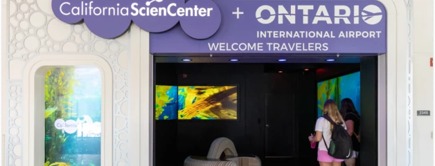
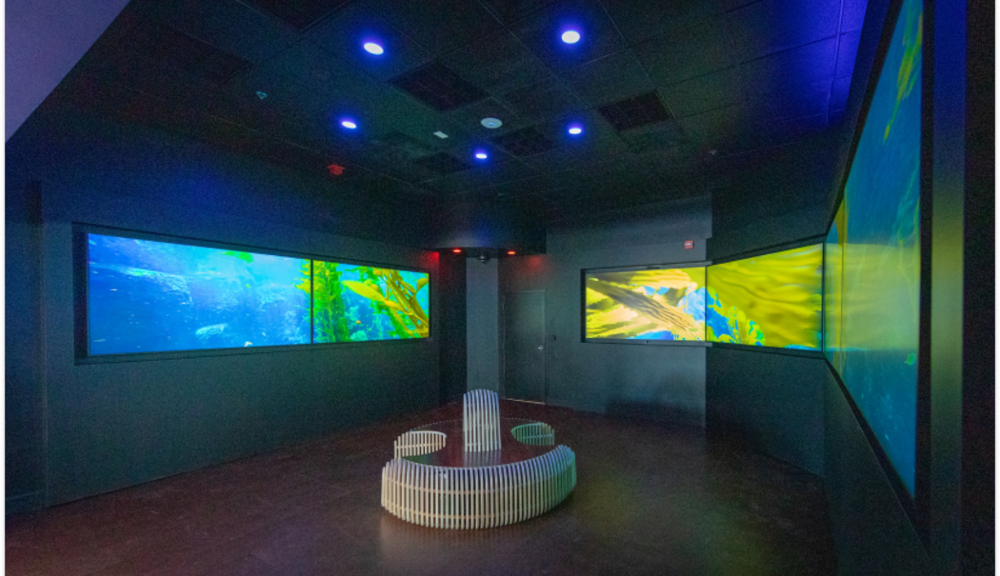

# California Science Center at ONT

A multi-display TouchDesigner installation for the California Science Center's exhibit inside Ontario International Airport — the Science Center's first exhibit outside its Exposition Park campus.

 

*Photos courtesy of [Ontario International Airport / California Science Center](https://www.flyontario.com/california-science-center).*

## Overview

Opened September 17, 2024, "California Science Center at ONT" is a dedicated space in Terminal 4 of Ontario International Airport where travelers can relax pre-flight inside an immersive, curated environment. The launch experience showcases the Kelp Forest, a highlight of the Science Center's Ecosystems wing — footage captured by professional divers inside the Center's 188,000-gallon aquarium specifically for this installation.

The space is also open to non-travelers through ONT's ONT+ digital visitor pass program.

> "This specially-created experience transports travelers to one of our most popular exhibits to be immersed in a giant kelp forest ecosystem, providing enrichment to people's lives as they prepare to take flight on their next adventure."
> — Jeffrey Rudolph, President & CEO, California Science Center

## Partnership

A collaboration between the California Science Center — one of the top 10 most-visited museums in the country, and the busiest west of the Mississippi — and Ontario International Airport, as part of ONT's investment in passenger amenities and experience.

## My Role

Built the TouchDesigner-driven multi-display system that plays back and synchronizes the video experience across the installation's screens, and composed the original score for the piece. An audio-reactive version of the visuals was also prototyped but never implemented in the final installation.

### Score excerpt

[kelp-forest-theme.mp3](media/kelp-forest-theme.mp3) — a short excerpt from the original score.

## Source

This repo doesn't include the production TouchDesigner project files, since they're California Science Center exhibit work.
